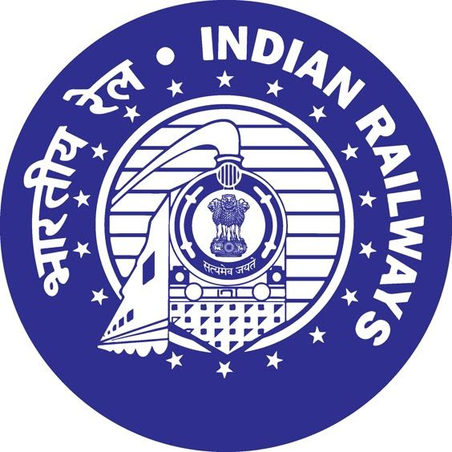

<div align="center">



# IRCTC Neo — Premium Redesign

**A cinematic, high-fidelity redesign of India's national railway booking platform**

_Reimagined with modern web technologies, fluid animations, and world-class UX_

<br/>

[](https://react.dev)
[](https://www.typescriptlang.org)
[](https://vite.dev)
[](https://motion.dev)
[](https://tailwindcss.com)
[](https://www.djangoproject.com)

<br/>


</div>

---

## Table of Contents

- [Overview](#overview)
- [Screenshots](#screenshots)
- [Features](#features)
- [Tech Stack](#tech-stack)
- [Project Structure](#project-structure)
- [Getting Started](#getting-started)
- [Backend Setup](#backend-setup)
- [Design System](#design-system)
- [Internationalization](#internationalization)
- [Authentication](#authentication)
- [Animation Philosophy](#animation-philosophy)
- [Disclaimer](#disclaimer)

---

## Overview

**IRCTC Neo** is a conceptual, premium-grade redesign of the [Indian Railway Catering and Tourism Corporation](https://www.irctc.co.in/) (IRCTC) booking portal. This project reimagines India's largest e-commerce platform with a cinematic visual identity, spring-physics animations, and a world-class user experience — while faithfully preserving all core booking functionality.

The project is a full-stack implementation featuring:

- A **React 19 + TypeScript** frontend with glassmorphic UI, parallax scrolling, and Framer Motion animations
- A **Django REST Framework** backend with JWT authentication, user registration, and a clean API architecture
- A **dual-theme design system** (dark/light) powered entirely by CSS custom properties
- Full **EN/HI bilingual support** across 60+ UI strings

> **Disclaimer:** This is a UI/UX concept project for educational and portfolio purposes only. It is not affiliated with or endorsed by IRCTC or Indian Railways. No real booking functionality or payment processing is implemented.

---

## Screenshots

<details open>
<summary><strong>Dark Mode</strong></summary>

| Hero Section | Services Section |
|:-:|:-:|
|  |  |

</details>

<details open>
<summary><strong>Light Mode</strong></summary>

| Hero Section |
|:-:|
|  |

</details>

<details open>
<summary><strong>Multi-Step Authentication Modal</strong></summary>

| Login | Agent Confirmation | Agent OTP |
|:-:|:-:|:-:|
|  |  |  |

</details>

---

## Features

### Visual Design

| Feature | Description |
|---|---|
| **Cinematic Hero** | Full-bleed Indian Railways locomotive background with Ken Burns parallax scrolling |
| **Glassmorphism System** | Multi-layered frosted glass panels with gradient borders, inner glow, and mouse spotlight effects |
| **Dual Theme** | Fully theme-aware dark/light mode powered by CSS custom properties — zero flash on switch |
| **Premium Typography** | [Outfit](https://fonts.google.com/specimen/Outfit) for headings, [Plus Jakarta Sans](https://fonts.google.com/specimen/Plus+Jakarta+Sans) for UI, [JetBrains Mono](https://fonts.google.com/specimen/JetBrains+Mono) for code and numbers |
| **Ambient Particles** | Floating particle field rendered in CSS with staggered animation timing |
| **Mouse Spotlight** | Interactive radial gradient that tracks cursor position across glass panels |

### Interactions and Animations

| Feature | Description |
|---|---|
| **Cinematic Sheen** | Second heading line sweeps a light gradient across text on hover using `@keyframes` and Framer Motion letterSpacing |
| **Parallax Text Shadow** | Text shadow angle shifts dynamically in real-time based on cursor XY position |
| **Ambient Glow Buttons** | LED-style blue ambient light that intensifies dramatically on hover via layered `box-shadow` |
| **3D Tilt Cards** | Service cards respond to `mousemove` with `perspective()` and `rotateX/Y` transforms plus a spotlight overlay |
| **Spring Physics** | All Framer Motion animations use `type: "spring"` — no linear easing anywhere |
| **Splash Screen** | Branded cinematic loading sequence with animated progress bar and staggered entrance |
| **Scroll Counters** | Stat numbers animate from 0 to target using `IntersectionObserver` and `requestAnimationFrame` easing |

### Authentication System

| Feature | Description |
|---|---|
| **Multi-State Modal FSM** | Fluid transitions between Login, Register, Agent Confirmation, and Agent OTP states |
| **Framer Motion `layout`** | Modal container height animates smoothly between states without hardcoded heights |
| **Floating Labels** | Input labels animate from placeholder to floating position using `AnimatePresence` |
| **6-Digit OTP Input** | Split input with auto-focus, clipboard paste support, and backspace navigation |
| **JWT Auth** | Real token-based login via Django backend on `localhost:8000`, with access and refresh token storage |
| **Registration** | Full user registration flow with server-side validation and field-level error feedback |
| **Glassmorphic Tooltips** | Hover popups with `backdrop-filter` blur and an animated arrow indicator |

### Booking Engine

| Feature | Description |
|---|---|
| **Station Autocomplete** | Fuzzy-search across 24 Indian railway stations by name, code, or city |
| **Train Search Results** | Searchable, filterable, sortable modal with 6 mock trains, class availability badges, and pricing |
| **Skeleton Loading** | Shimmer skeleton cards displayed while search results are loading |
| **PNR Checker** | 10-digit PNR input with animated progress bar and validation |
| **Charts and Vacancy** | Train number and date lookup with live status feedback |
| **Quick Routes** | One-tap route chips for popular city pairs |
| **Recent Searches** | Saved search history chips |
| **Advanced Options** | Expandable panel with Divyaang concession, Railway Pass, and Flexible Date toggles |
| **Toast Notifications** | Animated, auto-dismissing feedback toasts for every user action |

### Live Features

| Feature | Description |
|---|---|
| **Live Clock** | Real-time IST clock in the navbar, updating every second |
| **EN / HI Toggle** | Full bilingual support with 60+ translated strings, toggleable at runtime |
| **Live Alerts Marquee** | Auto-scrolling announcement banner with priority-tagged railway alerts (pauses on hover) |
| **Dark / Light Toggle** | Theme preference persisted to `localStorage` |

---

## Tech Stack

### Frontend

| Layer | Technology | Version |
|---|---|---|
| Framework | React | 19.x |
| Language | TypeScript | 6.0 |
| Build Tool | Vite | 8.x |
| Styling | Tailwind CSS | v4 |
| Animations | Framer Motion | 12.x |
| Icons | Lucide React | 1.x |
| Fonts | Google Fonts (Outfit, Plus Jakarta Sans, JetBrains Mono) | — |

### Backend

| Layer | Technology | Version |
|---|---|---|
| Framework | Django | 5.x |
| REST API | Django REST Framework | 3.14+ |
| Auth | djangorestframework-simplejwt | 5.3+ |
| CORS | django-cors-headers | 4.3+ |
| Database | SQLite (development) | — |

---

## Project Structure

```
irctc-neo/
│
├── public/
│   ├── irctc-logo.png              # IRCTC logo (navbar + splash + hero)
│   └── indian-train-bg.png         # Cinematic hero background image
│
├── screenshots/                    # README screenshots
│
├── backend/                        # Django REST API
│   ├── core/
│   │   ├── serializers.py          # RegisterSerializer with validation
│   │   ├── views.py                # /me/ and /register/ endpoints
│   │   └── urls.py                 # Core URL patterns
│   ├── settings.py                 # JWT, CORS, DRF, database config
│   ├── urls.py                     # Root URLs (admin, token, api/)
│   ├── requirements.txt            # Python dependencies
│   └── manage.py
│
├── src/
│   ├── components/
│   │   ├── AmbientButton.tsx       # LED-glow CTA button with tooltip
│   │   ├── AncillaryServices.tsx   # 3D tilt service cards section
│   │   ├── BookingEngine.tsx       # 3-tab booking form (search/PNR/charts)
│   │   ├── Footer.tsx              # 4-column site footer
│   │   ├── InteractiveHeading.tsx  # Cinematic sheen + parallax shadow heading
│   │   ├── LiveAlerts.tsx          # Auto-scrolling announcement marquee
│   │   ├── LiveClock.tsx           # Real-time clock component
│   │   ├── LoginModal.tsx          # Multi-step auth modal (JWT + registration)
│   │   ├── Navbar.tsx              # Navigation with clock, lang, theme, auth
│   │   ├── SearchResultsModal.tsx  # Train results with filters and booking
│   │   ├── SplashScreen.tsx        # Branded loading animation
│   │   └── ThemeProvider.tsx       # Dark/Light theme context
│   │
│   ├── data/
│   │   └── mockData.ts             # Stations, trains, classes, quotas, alerts
│   │
│   ├── i18n/
│   │   ├── translations.ts         # EN/HI dictionary (60+ strings)
│   │   └── LanguageProvider.tsx    # React context for i18n
│   │
│   ├── lib/
│   │   └── utils.ts                # cn() classname utility + getTomorrow()
│   │
│   ├── App.tsx                     # Root layout, hero section, stat counters
│   ├── index.css                   # Full design system (1400+ lines of CSS)
│   └── main.tsx                    # React entry point
│
├── index.html                      # HTML shell with Google Fonts and meta tags
├── vite.config.ts                  # Vite + Tailwind + path alias config
├── tsconfig.app.json               # TypeScript config (path aliases, strict)
├── package.json
└── eslint.config.js
```

---

## Getting Started

### Prerequisites

- [Node.js](https://nodejs.org/) version 20 or higher (required by Vite 8 and Rolldown)
- npm version 9 or higher (or yarn / pnpm)

### Frontend Installation

```bash
# 1. Clone the repository
git clone https://github.com/adityasharmass12/IRCTC-Neo.git
cd IRCTC-Neo

# 2. Install dependencies
npm install

# 3. Start the development server
npm run dev
```

The app will be available at **http://localhost:5173**

### Production Build

```bash
npm run build      # Compiles TypeScript and bundles with Vite/Rolldown
npm run preview    # Serves the production build locally
```

### Linting

```bash
npm run lint       # Run ESLint with TypeScript and React Hooks rules
```

---

## Backend Setup

The Django backend powers real JWT authentication (login, registration, and token refresh). It is **optional** — the frontend works standalone with mock data, but the login modal requires the backend for actual authentication.

### Prerequisites

- Python 3.10 or higher
- pip

### Installation

```bash
# 1. Navigate to the backend directory
cd backend

# 2. Create and activate a virtual environment
python -m venv venv
source venv/bin/activate       # macOS / Linux
venv\Scripts\activate          # Windows

# 3. Install dependencies
pip install -r requirements.txt

# 4. Apply database migrations
python manage.py migrate

# 5. (Optional) Create a superuser for Django Admin
python manage.py createsuperuser

# 6. Start the development server
python manage.py runserver
```

The API will be available at **http://localhost:8000**

### API Endpoints

| Method | Endpoint | Auth Required | Description |
|---|---|---|---|
| `POST` | `/api/token/` | No | Obtain JWT access and refresh tokens |
| `POST` | `/api/token/refresh/` | No | Refresh an expired access token |
| `POST` | `/api/register/` | No | Create a new user account |
| `GET` | `/api/me/` | Yes (Bearer) | Fetch authenticated user details |
| `GET` | `/admin/` | Superuser | Django Admin panel |

### Environment Variables

For production deployments, set the following environment variables:

```bash
DJANGO_SECRET_KEY=your-strong-secret-key-here
DJANGO_DEBUG=False
DJANGO_ALLOWED_HOSTS=yourdomain.com,www.yourdomain.com
```

---

## Design System

The entire visual system is built on CSS custom properties, enabling zero-flash theme switching and a single source of truth for all design tokens.

### Glassmorphism Tokens

```css
/* Dark Mode */
--glass-bg:          rgba(255,255,255,0.04);
--glass-border-from: rgba(255,255,255,0.18);
--glass-border-to:   rgba(255,255,255,0.04);
--glass-glow:        rgba(74,130,184,0.12);
--glass-inner:       rgba(255,255,255,0.06);

/* Light Mode */
--glass-bg:          rgba(255,255,255,0.12);
--glass-border-from: rgba(255,255,255,0.60);
--glass-border-to:   rgba(255,255,255,0.15);
--glass-glow:        rgba(74,130,184,0.08);
--glass-inner:       rgba(255,255,255,0.30);
```

### Core Color Tokens

| Token | Light Mode | Dark Mode | Purpose |
|---|---|---|---|
| `--clr-primary` | `#1a3a5c` | `#4A82B8` | Trust Blue — primary actions, borders |
| `--clr-accent` | `#E87733` | `#F09040` | Saffron — CTAs, highlights |
| `--clr-success` | `#138808` | `#22C55E` | India Green — confirmations |
| `--clr-danger` | `#C0392B` | `#EF4444` | Alerts, errors |
| `--clr-bg` | `#F0F2F5` | `#0D1520` | Page background |
| `--clr-surface` | `#FFFFFF` | `#141E2E` | Card and panel surfaces |

### Typography Scale

```css
--font-ui:      "Plus Jakarta Sans", "Sora", system-ui, sans-serif;
--font-heading: "Outfit", system-ui, sans-serif;
--font-mono:    "JetBrains Mono", ui-monospace, monospace;
```

---

## Internationalization

The app supports real-time language switching between **English** and **Hindi** using a lightweight custom i18n system built with React Context.

- Toggle the language using the **EN / हि** button in the navbar
- All 60+ UI strings switch instantly with no page reload
- Translations cover: navigation, hero section, booking engine, services, footer, and stat labels

To add a new translation string:

1. Add the key to the `TranslationStrings` interface in `src/i18n/translations.ts`
2. Add the English value under `const en`
3. Add the Hindi value under `const hi`
4. Access it in any component via `const { t } = useLang()`

---

## Authentication

The login modal implements a **finite state machine** with smooth Framer Motion transitions across four states:

```
Login ──────────────────────────────────> [JWT Sign In]
  │
  ├─── Register ──────────────────────> [Create Account via /api/register/]
  │
  └─── Agent Login
          │
          └─── Agent Confirmation ──> Agent OTP ──> [Verify & Login]
```

**Token Storage:** JWT access and refresh tokens are stored in `localStorage` under the keys `irctc_access_token` and `irctc_refresh_token`.

**Security Note:** For production, consider storing tokens in `httpOnly` cookies instead of `localStorage` to mitigate XSS risk.

---

## Animation Philosophy

Every animation in this project uses **spring physics** via Framer Motion — never linear easing. This produces a natural, premium feel that distinguishes the interface from standard web applications.

```tsx
// Standard spring — used for most UI interactions
transition={{ type: "spring", stiffness: 400, damping: 25 }}

// Snappy spring — used for dropdowns and modals
transition={{ type: "spring", stiffness: 500, damping: 35 }}

// Cinematic ease — used for page-level entrances
transition={{ duration: 1.5, ease: [0.22, 1, 0.36, 1] }}
```

Key animation techniques used throughout the project:

- **`AnimatePresence`** for mount/unmount transitions on dropdowns, toasts, and modals
- **`layout` prop** for smooth height animation on the login modal between states
- **`useTransform` and `useScroll`** for parallax on the hero background
- **`IntersectionObserver` and `requestAnimationFrame`** for scroll-triggered stat counters
- **CSS `@keyframes`** for the Ken Burns effect, particle system, and marquee scroll
- **`transform-style: preserve-3d` and `perspective()`** for 3D card tilt on service cards

---

## Disclaimer

This project is released for **educational and portfolio purposes only**.

- The IRCTC name, logo, and branding are registered trademarks of [Indian Railway Catering and Tourism Corporation Ltd](https://www.irctc.co.in/)
- Indian Railways branding belongs to the Ministry of Railways, Government of India
- This project does not process real transactions, real personal data, or real bookings
- No official affiliation with or endorsement by IRCTC or Indian Railways

---

<div align="center">

**Built for Indian Railways**

_A conceptual redesign demonstrating modern React architecture, premium UI/UX design, and full-stack JWT authentication_

</div>
